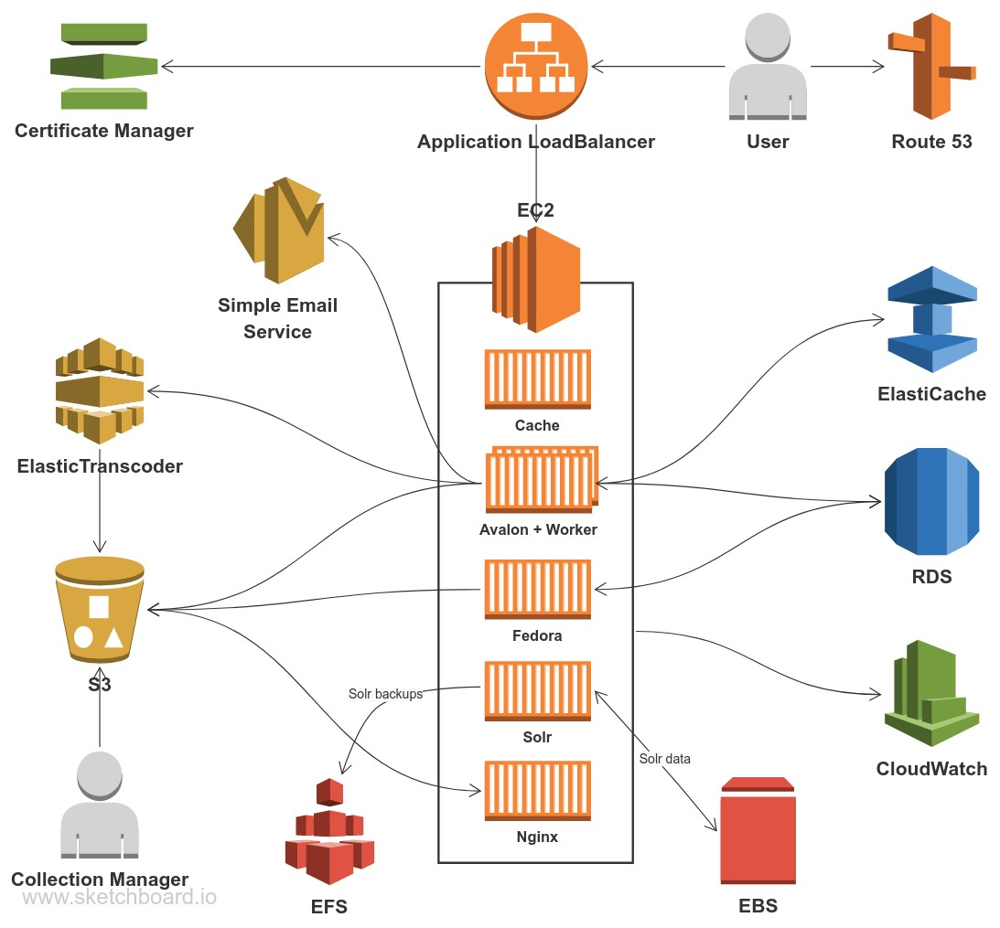

Turnkey solution for Avalon on AWS, using Terraform

# Goals

The goal of this solution is to provide a simple, cost-effective way to put Avalon on the cloud, while remaining resilient, performant and easy to manage. It aims to serve collections with low to medium traffic.

# Architecture diagram


# Getting started
## Prerequisites

1. Download and install [Terraform 0.12+](https://www.terraform.io/downloads.html). The scripts have been upgraded to HCL 2 and therefore incompatible with earlier versions of Terraform.
1. Clone this repo
1. Create or import an [EC2 key-pair](http://docs.aws.amazon.com/AWSEC2/latest/UserGuide/ec2-key-pairs.html) for your region.
1. Create an S3 bucket to hold the terraform state file. This is useful when
    executing terraform on multiple machines (or working as a team) because it allows state to remain in sync. 
1. Create a file `dev.tfbackend` and fill in the previously created bucket name, its region, and a bucket key for where the state file file be stored.

    ```
    bucket = "my-terraform-state"
    key    = "state.tfstate"
    region = "us-east-1"
    ````
1. Create an IAM user that Fedora will use to sign its S3 requests.
1. Create a [public hosted zone in Route53](http://docs.aws.amazon.com/Route53/latest/DeveloperGuide/CreatingHostedZone.html); Terraform will automatically manage DNS entries in this zone. A registered domain name is needed to pair with the Route53 hosted zone. You can [use Route53 to register a new domain](http://docs.aws.amazon.com/Route53/latest/DeveloperGuide/domain-register.html) or [use Route53 to manage an existing domain](http://docs.aws.amazon.com/Route53/latest/DeveloperGuide/MigratingDNS.html).
1. Copy `terraform.tfvars.example` to `terraform.tfvars` and fill in the relevant information:
    ```
    environment         = "dev"
    hosted_zone_name    = "mydomain.org"
    ec2_keyname         = "my-ec2-key"
    stack_name          = "mystack"
    fcrepo_binary_bucket_username   = "iam_user"
    fcrepo_binary_bucket_access_key = "***********"
    fcrepo_binary_bucket_secret_key = "***********"
    tags {
      Creator    = "me"
      AnotherTag = "Whatever value I want!"
    }
    ```
    * Note: You can have more than one variable file and pass the name on the command line to manage more than one stack.
1. Execute `terraform init  -reconfigure -backend-config=dev.tfbackend`.

## Bringing up the stack

To see the changes Terraform will make:

    terraform plan

To actually make those changes:

    terraform apply

Be patient, the script attempts to register SSL certificates for your domains and AWS cert validation process can take from 5 to 30 minutes.

## Extra settings

### Email

In order for Avalon to send mails using AWS, you need to add these variables to the `terraform.tfvars` file and make sure these email addresses are [verified in Simple Email Service](https://docs.aws.amazon.com/ses/latest/DeveloperGuide/verify-email-addresses.html):

    email_comments      = "comments@mydomain.org"
    email_notification  = "notification@mydomain.org"
    email_support       = "support@mydomain.org"

### Authentication

Turnkey comes bundled with [Persona](https://github.com/samvera-labs/samvera-persona) by default but can be configured to work with other authentication strategies by using the appropriate omniauth gems. Refer to [this doc](https://samvera.atlassian.net/wiki/spaces/AVALON/pages/1957954771/Manual+Installation+Instructions#ManualInstallationInstructions-AuthenticationStrategy) for integration instruction.

# Maintenance

## Upgrading Avalon
Upgrading the version of Avalon running in the stack happens by running the CodeBuild build created by terraform and not through `terraform apply`.  If you have customized your Avalon instance, first rebase your changes on top of the latest Avalon release, resolve conflicts, and push to your branch.

Then log into the AWS console and go to CodeBuild.  Go into the details of the build created by terraform (e.g. "avalon-demo-build-project") and click "Start Build".  This will rebuild the container image from the Avalon code branch used initially when bringing up the stack.  The built image is pushed to the AWS container registry and an SSM message triggers pulling down the new image and restarting docker-compose on the EC2 instance.


## Update the stack
You can proceed with `terraform plan` and `terraform apply` as often as you want to see and apply changes to the
stack. Changes you make to the `*.tf` files  will automatically be reflected in the resources under Terraform's
control.

## Destroy the stack
Special care must be taken if you want to retain all data when destroying the stack. If that wasn't a concern, you can simply run
    
    terraform destroy

## Update the containers
Since Avalon, Fedora, Solr and Nginx are running inside Docker containers managed by docker-compose, you can SSH to the EC2 box and run docker-compose commands as usual.

    docker-compose pull
    docker-compose up -d

## Performance & Cost
The EC2 instances are sized to minimize cost and allow occasional bursts (mostly by using `t3`). However if your system is constantly utilizing 30%+ CPU, it might be cheaper & more performant to switch to larger `t2` or `m5` instances.

Cost can be further reduced by using [reserved instances](https://aws.amazon.com/ec2/pricing/reserved-instances/pricing/) - commiting to buy EC2 for months or years.

Out of the box, the system can service up to 100 concurrent streaming users without serious performance degradation. More performance can be achieved by scaling up using a larger EC2 instance.
